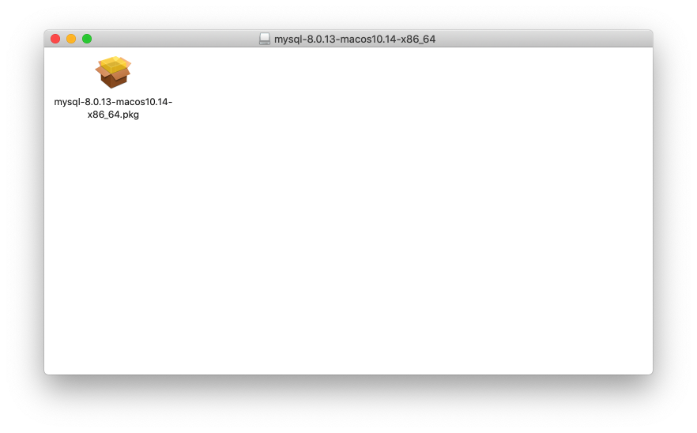

# 九、数据库

**学习目标**

- 理解数据库概念
- 创建数据库
- 创建数据表
- 增删改操作
- 查询操作

## 数据库入门

### 数据库基础知识

### MySQL 安装与配置

#### Windows

参考链接：

- https://dev.mysql.com/doc/refman/8.0/en/mysql-installer.html

#### macOS

查看启动状态

参考链接：

- https://dev.mysql.com/doc/refman/8.0/en/osx-installation-pkg.html

#### Linux

参考链接：

- https://dev.mysql.com/doc/refman/8.0/en/linux-installation.html

### MySQL 目录结构

### MySQL 的使用

## 数据库和表的基本操作

### 数据库基础知识

### 数据类型

### 数据表的基本操作

### 表的约束

## 添加、更新与删除数据

## 单表查询

## 多表查询
