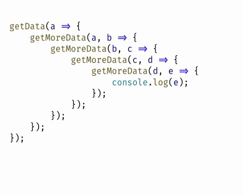
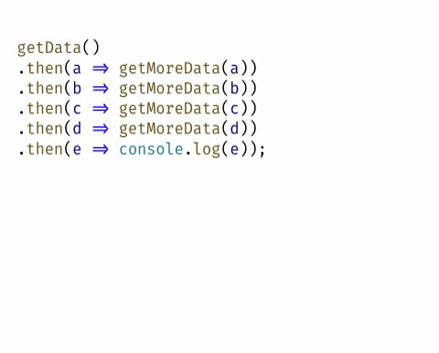
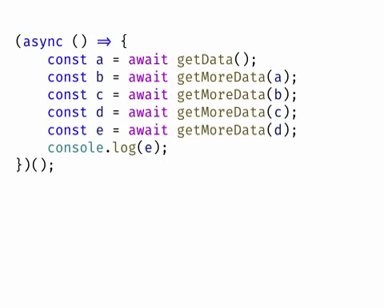
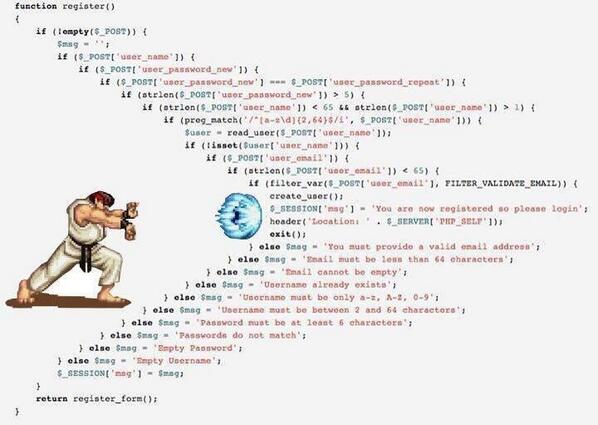

# 第 14 章 异步编程

回调函数（差）



Promise（好）



Async（更好）



## 回调函数

### 概念

- [知乎 - 回调函数（callback）是什么？](https://www.zhihu.com/question/19801131)

你寻求一个陌生人的帮助。

- 等待他帮你完成这件事儿
- 回去继续你的工作，**留一个电话给他（注册回调）**
  - 他帮我完整这件事儿之后我干嘛？
  - 我决定，他只需要把结果告诉我
  - 结果：有的结果由数据，有的结果无数据
- 当他完成打你的电话通知你（调用回调函数）

你到一个商店买东西，刚好你要的东西没有货，于是你在店员那里**留下了你的电话**，过了几天店里有货了，店员就**打了你的电话**，然后你接到电话后就到店里去取了货。在这个例子里，**你的电话号码就叫回调函数**，**你把电话留给店员就叫登记回调函数**，店里后来有货了叫做触发了回调关联的事件，**店员给你打电话叫做调用回调函数**，你到店里去取货叫做响应回调事件。回答完毕。 作者：常溪玲链接：https://www.zhihu.com/question/19801131/answer/13005983来源：知乎著作权归作者所有。商业转载请联系作者获得授权，非商业转载请注明出处。

我勒个去，一句话搞定的事，非得啰嗦那么多?

简单举例来说就是，我打电话找你帮忙办事，但是不确定什么时间办完，我让你办完了再电话通知我。我让你通知我就是我设定的回调函数！一般用于异步通信场景。如果我不挂电话，非等你办完了知道结果了再挂这就不属于异步通信，也无需回调！作者：柳明军链接：https://www.zhihu.com/question/19801131/answer/43799125来源：知乎著作权归作者所有。商业转载请联系作者获得授权，非商业转载请注明出处。

### JavaScript 回调函数

获取普通方法的返回值（方式一 return）：

```javascript
function add(x, y) {
  return x + y;
}

const ret = fn(); // => 123
```

获取普通方法的返回值（方式二 函数）：

```javascript
// 是不是傻？同步回调，闲的蛋疼！
function add(x, y, callback) {
  callback(x + y);
}

add(10, 20, function(ret) {
  console.log(ret);
});
```

对于上面的代码我们肯定会有疑问，是不是傻？干嘛搞这么麻烦，第一种明显就 OK 了，难道第二种只是一种方式问题吗，聪明人肯定会选择第一种。

那大家姑且就先把它当作一种方式吧，在这里是先让大家明白一个道理：**在 JavaScript 中函数也是一种数据类型，函数也可以当作参数进行传递** 。

那我们到底什么时候需要使用回调函数呢？

> 请记住： **当需要得到一个函数中的异步操作结果的时候，我们就必须使用回调函数了（上面的第二种方式）。**
>
> - 定时器
> - ajax
> - readFile、writeFile

请看下面的例子：

例如，获取一个函数中异步操作的结果：

```javascript
function fn() {
  setTimeout(function() {
    // 我想调用 fn 得到这里的 num
    const num = 123;
  }, 1000);
}
```

想法一（行不通）：

```javascript
function fn() {
  console.log(1);
  setTimeout(function() {
    console.log(2);
    // 我想调用 fn 得到这里的 num
    const num = 123;
    // 从返回值角度来讲，这里的 return 也只是返回给了当前的函数，而非外部的 fn 函数
    return num;
  }, 1000);
  // 到这里 fn 函数就执行结束了，所以不可能得到里面 return 的结果
  console.log(3);
}
```

想法二（行不通）：

```javascript
function fn() {
  console.log(1, "函数开始执行");
  let num;

  // 定时器是异步的，所以遇到定时器不会等待，函数会继续往后执行
  setTimeout(function() {
    console.log(2);

    // 我想调用 fn 得到这里的 num
    num = 123;
  }, 1000);

  // 到这里 fn 函数就执行结束了（定时器还没有被调用），所以你拿到的 num 就是 undefined
  console.log(3);
}
```

正确的方式（通过函数来接收异步操作结果，这就是回调函数，因为不是立即调用，而是回头再调用）：

```javascript
// 2. 在 fn 函数中通过形参 callback 接收了 handler 函数
function fn (callback) {
  // var callback = handler
  // callback 就是我们的 handler
  console.log(1, '函数开始执行')

  // 定时器是异步的，所以遇到定时器不会等待，函数会继续往后执行
  setTimeout(function () {
    console.log(2)

    // 我想调用 fn 得到这里的 num
    const num = 123

    // 定时器操作结束，我们就可以在这里调用 callback（也就是我们的 handler）函数，把结果 num 传递给了该函数
    // 我们这里调用 callback 也就是在调用 handler
    callback(num)
  }, 1000)

  // 到这里 fn 函数就执行结束了（定时器还没有被调用），所以你拿到的 num 就是 undefined
  console.log(3)
}

function handler = function (data) {
  console.log('handler 函数被调用了：', data)
}

// 1. 这里把 handler 传递到了 fn 函数中
fn(handler)
```

上面的方式比较繁琐，我们没必要单独定义一个全局函数，我们可以可以在调用的时候直接传递一个匿名函数即可：

```javascript
function fn(callback) {
  setTimeout(function() {
    const num = 123;
    callback(num);
  });
}

fn(function(data) {
  console.log("回调函数被执行了：", data);
});
```

### 示例：封装原生的 `ajax` 操作

> [MDN - Using XMLHttpRequest](https://developer.mozilla.org/zh-CN/docs/Web/API/XMLHttpRequest/Using_XMLHttpRequest)

```javascript
function reqListener() {
  console.log(this.responseText);
}

var oReq = new XMLHttpRequest();
oReq.onload = reqListener;
oReq.open("get", "yourFile.txt", true);
oReq.send();
```

### 示例：实现拷贝方法

已知 `fs.readFile` 可以读取文件，`fs.writeFile` 可以写文件。请帮我封装一个方法：`copy`。要求调用方式如下：

```javascript
copy("被复制文件", "复制到的目标文件", function(err) {
  // err 成功是 null 错误是一个 错误对象
});
```

### 示例：读取文件中的 todos 列表数据

已知一个 json 文件内容如下：

```json
{
  "todos": ["吃饭", "睡觉", "打豆豆"]
}
```

请帮我写一个方法，调用该方法得到的结果就是 todos **数组** 。

### 示例：把任务持久化保存到文件中

已知有一个 json 文件内容如下：

```json
{
  "todos": ["吃饭", "睡觉", "打豆豆"]
}
```

请帮我写一个方法，调用该方法可以帮我把指定的数据存储到 json 文件中的 todos 中。例如：

```javascript
// 该方法肯定是异步的，所以无论操作成功与否你都必须告诉我
// err 是错误的标志，如果有错你就告诉我，如果没错就给我一个 null
// 那调用者就可以通过 err 参数来判定 addTodo 的操作结果到底成功与否
addTodo("写代码", function(err) {});
```

---

## 异常处理

- try-catch
- 回调函数 Error First
- **如果封装的函数中有错误，不要在函数中自行处理，一般是把错误对象放到回调函数的第一个参数，这是一种约定规则，错误优先，由调用者决定如何处理这个错误**
- 在自己封装的回调函数中不要自己处理错误
- 如果有错，则把错误对象作为回调函数的第一个参数传递给回调函数
- 错误优先：Error First

### try-catch 处理异常

### Callback 处理异常

### 问题：回调地狱



```javascript
const fs = require("fs");

fs.readFile("./data/a.txt", "utf8", (err, dataA) => {
  if (err) {
    throw err;
  }
  fs.readFile("./data/b.txt", "utf8", (err, dataB) => {
    if (err) {
      throw err;
    }

    fs.readFile("./data/c.txt", "utf8", (err, dataC) => {
      if (err) {
        throw err;
      }
      fs.writeFile("./data/d.txt", dataA + dataB + dataC, err => {
        if (err) {
          throw err;
        }
        console.log("success");
      });
    });
  });
});
```

## Promise

- 一个容器，用来封装一个异步任务
- 三种状态
  - Pending
  - Resolved
  - Rejected
- 成功调用 resolve
- 失败调用 reject

### Promise 基本用法

### 几个例子

实例一：Promise 版本的定时器

```javascript
function sleep(time) {
  return new Promise((resolve, reject) => {
    setTimeout(function() {
      resolve();
    }, time);
  });
}

sleep(1000)
  .then(() => {
    console.log("吃饭");
    return sleep(2000);
  })
  .then(() => {
    console.log("睡觉");
    return sleep(3000);
  })
  .then(() => {
    console.log("坐火车回家");
  });
```

封装 Promise 版本的 `readFile` ：

```javascript
function readFile(...args) {
  return new Promise((resolve, reject) => {
    fs.readFile(...args, (err, data) => {
      err ? reject(err) : resolve(data);
    });
  });
}

readFile("./data/a.txt", "utf8").then(data => {
  console.log(data);
});
```

另一个例子：读取文件

```javascript
function readFile(...args) {
  return new Promise((resolve, reject) => {
    fs.readFile(...args, (err, data) => {
      err ? reject(err) : resolve(data);
    });
  });
}

function writeFile(...args) {
  return new Promise((resolve, reject) => {
    fs.writeFile(...args, err => {
      err ? reject(err) : resolve();
    });
  });
}

let ret = "";

readFile("./data/a.txt", "utf8")
  .then(data => {
    ret += data;
    return readFile("./data/b.txt", "utf8");
  })
  .then(data => {
    ret += data;
    return readFile("./data/c.txt", "utf8");
  })
  .then(data => {
    ret += data;
    // fs.writeFile('./data/e.txt', ret, err => {
    // })
    return writeFile("./data/e.txt", ret);
  })
  .then(() => {
    console.log("success");
  });
```

示例：封装 Promise 版本的 ajax

```javascript
var ajax = {};

ajax.get = function(url) {
  return new Promise((resolve, reject) => {
    var oReq = new XMLHttpRequest();
    oReq.onload = function() {
      resolve(this.responseText);
    };
    oReq.open("get", url, true);
    oReq.send();
  });
};
```

带有业务的封装：

```javascript
var ajax = {};

ajax.get = function(url) {
  return new Promise((resolve, reject) => {
    var oReq = new XMLHttpRequest();
    oReq.onload = function() {
      // callback(this.responseText)
      resolve(this.responseText);
    };
    oReq.open("get", url, true);
    oReq.send();
  });
};

function duquabc() {
  return new Promise((resolve, reject) => {
    let ret = "";
    ajax
      .get("./data/a.txt")
      .then(data => {
        ret += data;
        return ajax.get("./data/b.txt");
      })
      .then(data => {
        ret += data;
        return ajax.get("./data/c.txt");
      })
      .then(data => {
        ret += data;
        resolve(ret);
      });
  });
}

duquabc().then(ret => {
  console.log(ret);
});
```

### 错误处理

- then 方法的第二个参数
  - 仅捕获 Promise 本身的异常
- catch 方法（推荐）
  - 不仅可以捕获 Promise 的异常
  - 还是可以捕获 resolve 函数中的异常
  - 如果后面还有 then 无法阻止
- then 方法无法被阻止

### Promise.all()

### Promise.race()

## Async 函数
